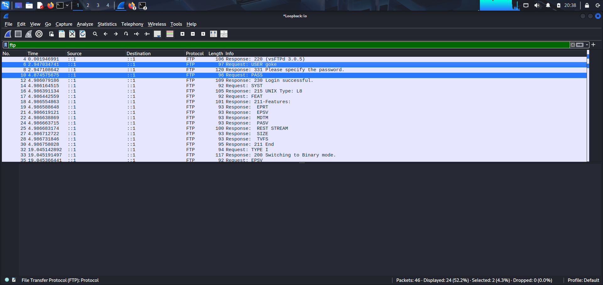
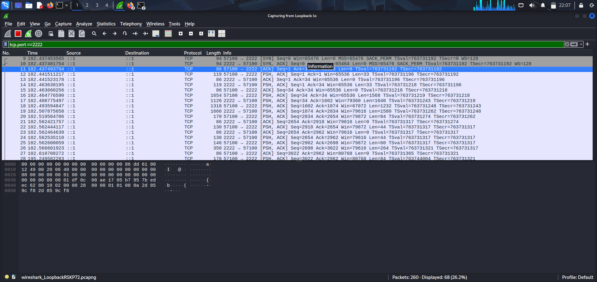

# FTP vs SFTP Security Analysis

## Introduction
In today's digital environment, secure data transfer is essential. FTP is unencrypted and vulnerable, while SFTP uses SSH encryption to ensure file integrity and confidentiality.

This project simulates file transfers via FTP and SFTP, then uses Wireshark to examine and compare the data recorded, highlighting the risks of unencrypted protocols.

## Overview
- Compare FTP and SFTP from a security standpoint
- Demonstrate Wireshark for traffic analysis
- Show real-world importance of encryption
- Provide actionable insights on why SFTP is the standard

## Methodology
### Environment Setup
- Installed and configured **vsftpd** for FTP
- Configured **OpenSSH** server for SFTP on port `2222`

### User and File Preparation
- Created FTP user: `goke`
- Created SFTP user: `sftpuser`
- Prepared `testfile.txt` with simple text

### File Transfer
- Used `ftp` command for FTP transfer
- Used `sftp` command for SFTP transfer
- Observed behavior and responses in terminal

### Packet Capture
- Captured traffic in Wireshark on loopback interface
- Filters:
  - FTP: `ftp`
  - SFTP: `tcp.port == 2222`
- FTP: USER, PASS, file content visible
- SFTP: All traffic encrypted

## Findings
### FTP (Unencrypted)
- **Credentials** visible in Wireshark (USER & PASS commands in plain text)
- **File contents** readable
- Runs on TCP port 21

### SFTP (Encrypted)
- No credentials visible
- All traffic unreadable
- Runs on TCP port 2222 (SSH)

## Security Comparison

| Feature             | FTP                  | SFTP               |
|---------------------|----------------------|--------------------|
| Port Used           | 21                   | 2222               |
| Encryption          | None                 | SSH (end-to-end)   |
| Credentials Visible | Yes                  | No                 |
| File Content Visible| Yes                  | No                 |
| Security Risk       | High                 | Low                |

## Conclusion
FTP sends passwords and file contents in plain text — unsafe for sensitive data.  
SFTP encrypts credentials and data, making it secure for enterprise, finance, and government systems.  
Wireshark analysis confirms the importance of encryption for safe file transfers.

## Screenshots
*(Add your screenshots here later)*

## Files
- [FTP vs SFTP Wireshark Capture (.pcap)](./files/ftp_vs_sftp.pcap)
- [Test file](./files/testfile.txt)
